autoscale: true
footer: Intro to CloudFront CDN
theme: Letters from Sweden, 4


# [fit] Intro to CloudFront

## [fit] Fast, highly secure and programmable content delivery network

### Calvin Hendryx-Parker
#### Six Feet Up

[.hide-footer]

---
# [fit] The Problem
* _Litterally has to do with physics_

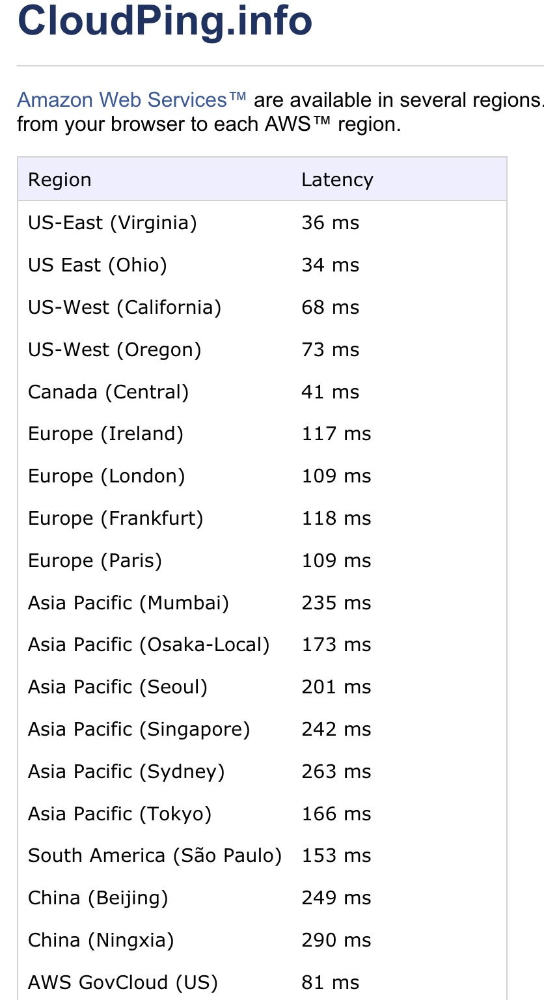

[.hide-footer]
[.build-lists: true]

^ Can't work around the speed of light (yet)

---

# What is a CDN?


^ 144 points of presence (PoPs) world wide

^ reducing bandwidth costs, improving page load times, or increasing global availability of content

---


# [fit] Common CDNs

 


^ Many Telcos also provide CDN capability (AT&T, CenturyLink, etc.)

^ some are free such as Cloudflare and specific ones that deliver common open-source libraries such as BoostrapCDN or JSDelivr

---


# Why CloudFront?

* Integrated with AWS
* Programmable via Lambda@Edge
* Authorized access via Signed URLs or Cookies
* Additional Security such as AWS Shield
* Compliance (PCI-DSS 1, HIPPA, ISO 27001, SOC)

^ S3, EC2, ELB, Route 53, AWS Elemental Media Services (transcoder)

^ CloudFront infrastructure and processes are compliant

---
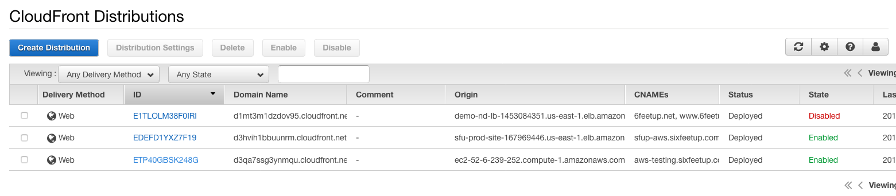

# Distributions

---
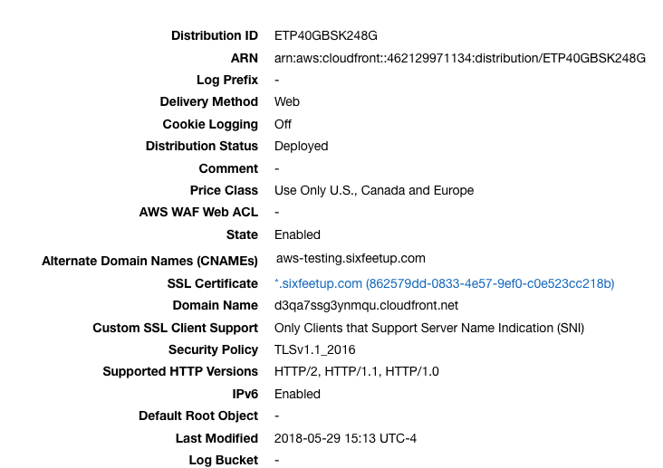

## Features

* Custom Domain Names
* Websockets
* Origin Groups
* RTMP
* Custom Origins
* HTTP/2

^ Changes to distributions can take 20-30 minutes to propagate

---

# Configuring DNS

```
www.sixfeetup.com.      3576    IN      CNAME   sixfeetup.com.
sixfeetup.com.          3571    IN      A       52.84.64.215
sixfeetup.com.          3571    IN      A       52.84.64.177
sixfeetup.com.          3571    IN      A       52.84.64.236
sixfeetup.com.          3571    IN      A       52.84.64.10
sixfeetup.com.          3571    IN      A       52.84.64.32
sixfeetup.com.          3571    IN      A       52.84.64.99
sixfeetup.com.          3571    IN      A       52.84.64.157
sixfeetup.com.          3571    IN      A       52.84.64.240
```

^ Recommended is to use Route 53, it will handle domain aliases automatically

---

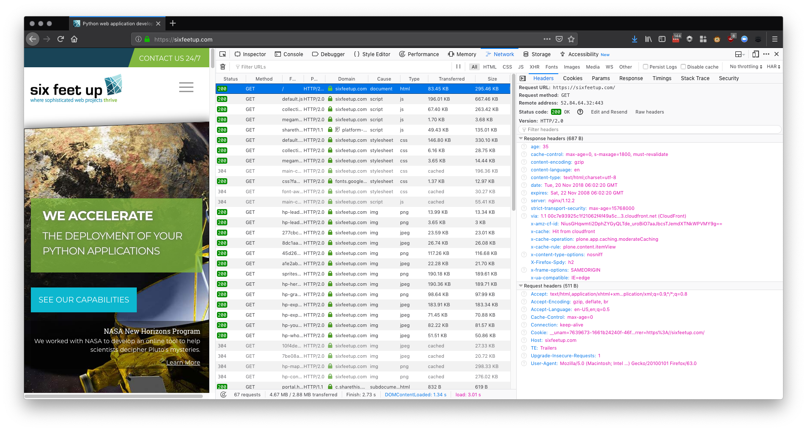

---
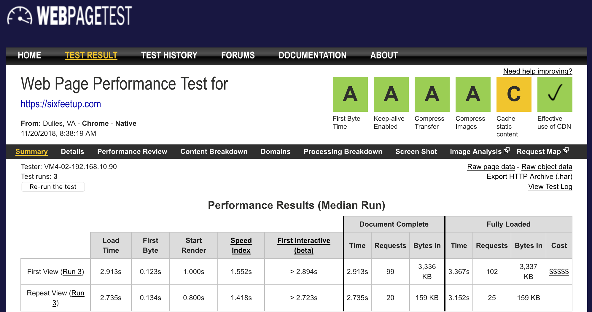

[.hide-footer]

---

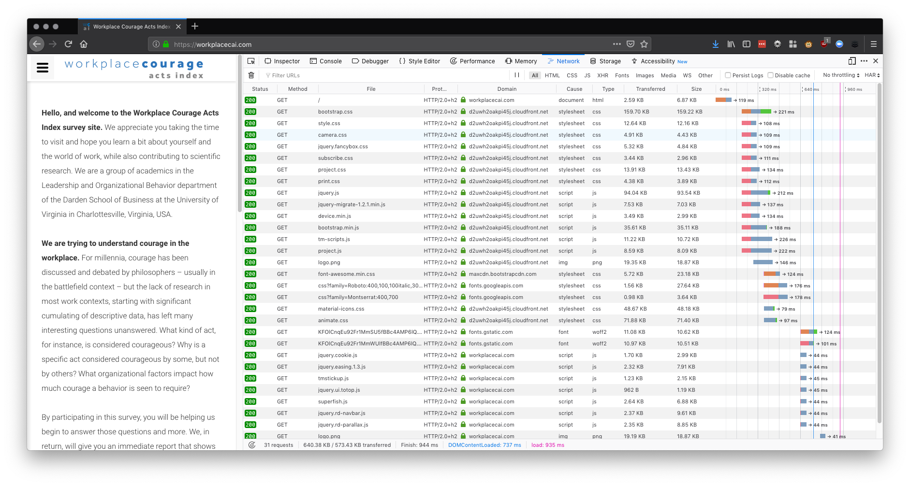

^ Example without custom DNS

^ Point out the HTTP/2 working here

---

# Origins


---

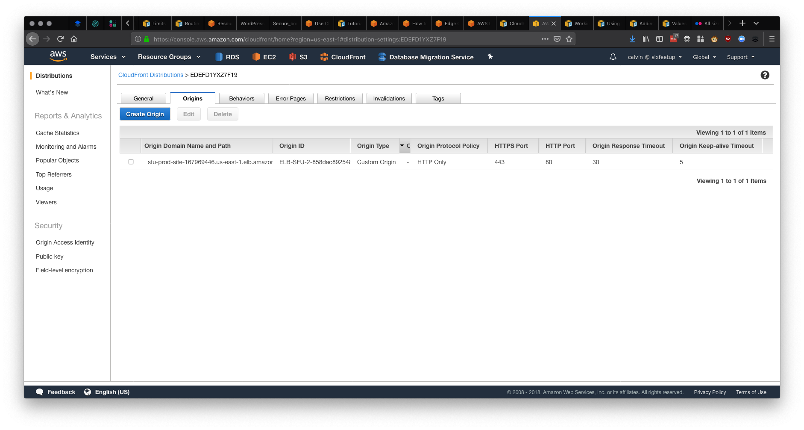

^ Multiple Origins for Half and Full Bridge HTTPS

---

# S3


^ Can point to a public bucket, but always better to authenticate requests with OAI

---

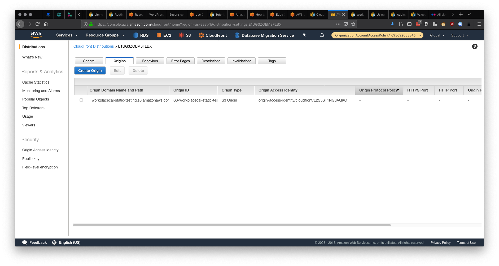

^ Uses OAI to authenticate requests to a private S3 bucket

^ Automatically places an ACL on our bucket for the Identity

---


# Behaviors

---
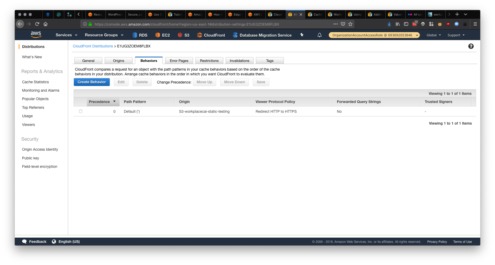

---


# [fit] CORS

^ Cross Origin Request Sharing

---

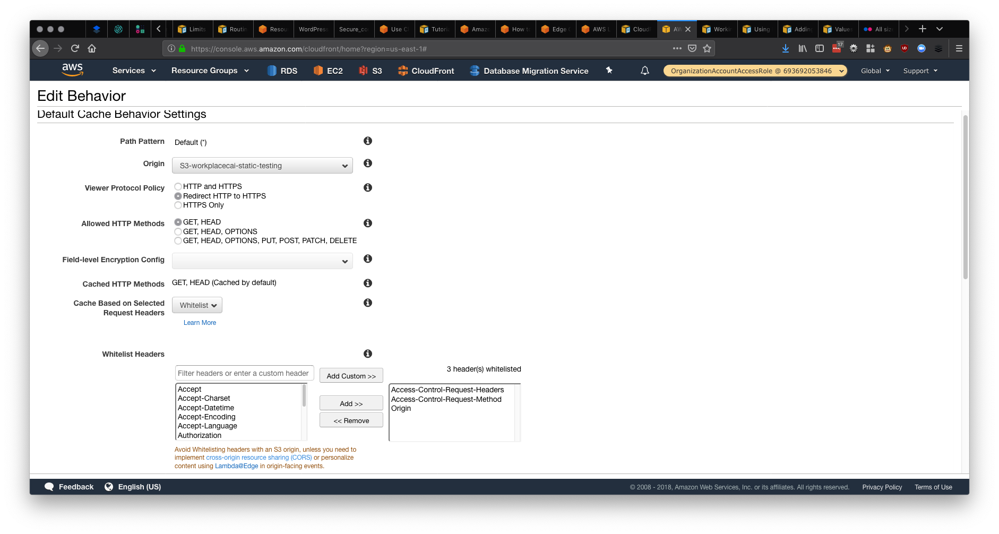

^ Normally for an S3 bucket you wouldn't whitelist headers or pass cookies

---

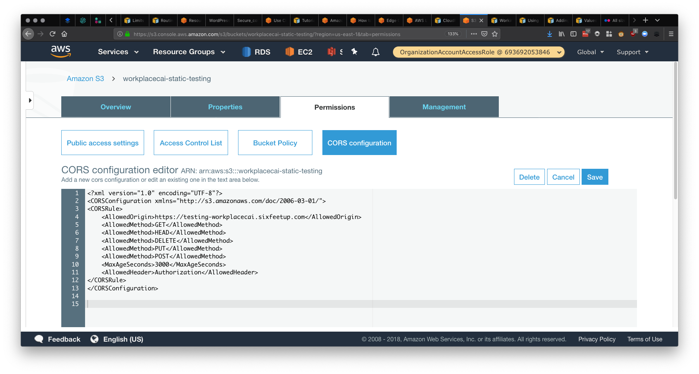

---


---


# Lambda@Edge

* Customize Content Delivered
* Inspect Cookies
* Rewrite Requests
* Make Network Calls
* Access the Request Body in POST/PUT
* Must be created in Node.js:registered: runtime

^ New as of August of this year

^ $.60 per 1M requests compared to standard Lambda at $.20 per 1M

^ Duration cost are also 200% more than standard lambda

^ Other limitations: no DLQ, no env vars, can't access resources in your VPC

---


# Common Lambda@Edge Uses

* Return 301 or 302 redirects
* Origin failover
* POST contact form data to DynamoDB
* Gathering web beacon data

^ limit of 100 triggers per CF distribution and have a maximum of 25 distributions with triggers

^ 4 trigger events (viewer req, origin req, origin resp, viewer resp)

^ each cache behavior can have up to four triggers

---


# [fit] Reports

---

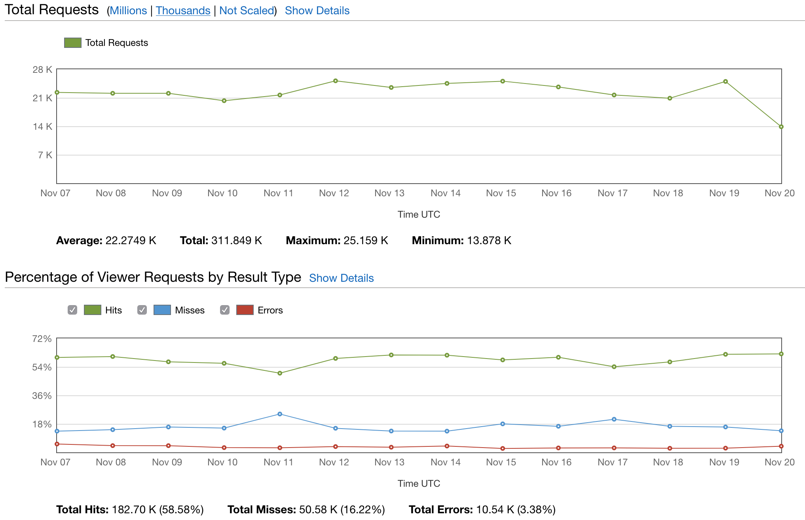

[.hide-footer]

^ Also includes Status Codes and 

---
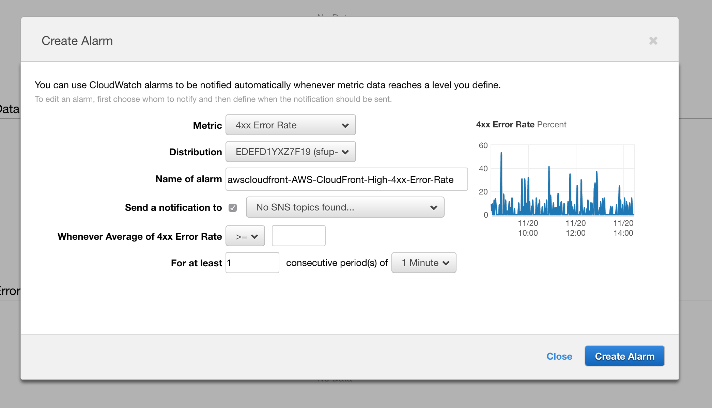

[.hide-footer]

---
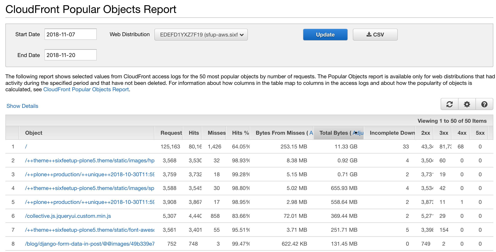

[.hide-footer]

^ Other reports such as Referrers, Viewers (Devices, Browsers, OS, Country) and Usage

---

# Example Deployments


* https://github.com/aws-samples/aws-refarch-drupal
* https://github.com/aws-samples/aws-refarch-moodle
* https://github.com/aws-samples/aws-refarch-wordpress

---


# [fit] Security

* Origin Access Identity
* Field-Level Encryption
* AWS Certificate Manager
* AWS Shield Standard
* AWS WAF
* https://github.com/aws-samples/aws-waf-sample

^ Shield Standards provides comprehensive availability protection against all known infrastructure (Layer 3 and 4) attacks

^ Shield Advanced requires 1 year min and $3k/mo, but has 24/7 access to the AWS DDoS Response Team and includes WAF

^ WAF has similar charges to Lambda@Edge, $0.60/million requests and $1 per rule and can go higher if you use managed rules

---
[.background-color: #FFFFFF]


---


# Costs

* Data Transfer Out
* HTTP/HTTPS Requests
* Invalidation Requests
* Field Level Encryption Requests
* Dedicated IP SSL :arrow_left: **Not Needed Generally**

^ Free Tier

^ no cost for internal transfer between CloudFront and AWS Services such as S3 and EC2 or ELB

---

# Resources

* https://docs.aws.amazon.com/AmazonCloudFront/latest/DeveloperGuide
* https://github.com/awsdocs/amazon-cloudfront-developer-guide
* https://docs.aws.amazon.com/cloudfront/latest/APIReference

^ Docs are open source and you can make pull requests

^ Docs are licensed under Creative Commons Attribution-ShareAlive 4.0

---


# [fit] Questions:grey_question:


### [@calvinhp](http://twitter.com/calvinhp)
### [calvin@sixfeetup.com](mailto:calvin@sixfeetup.com)
